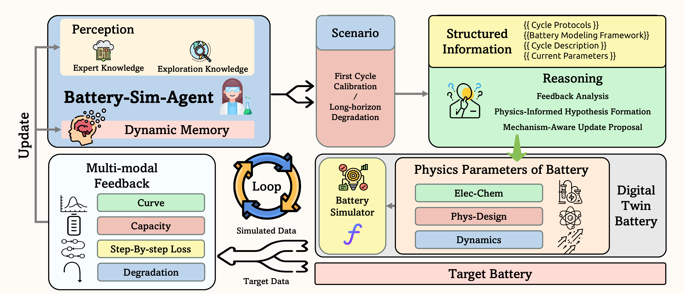

# Battery-Sim-Agent

Reference implementation of **"Battery-Sim-Agent: Leveraging LLM-Agent for Inverse Battery Parameter Estimation"** (KDD 2026).

The repository covers the LLM-agent that drives PyBaMM simulations to recover electrochemical parameters of lithium-ion cells, the simulated benchmark used in the paper, and the optimization baselines we compared against.



The agent proposes parameters for the PyBaMM simulator, compares the simulator output against target data to produce structured multi-modal feedback, and reasons over a dynamic memory to drive the next parameter update.

---

## Repository layout

```
Battery-Sim-Agent/
├── battery_agent/              # Main LLM agent (first-cycle and degradation pipelines)
│   ├── configs/                # exp / pybamm / llm config (llm.yaml is git-ignored)
│   ├── pipeline/               # first_cycle_pipeline.py, degradation_pipeline.py
│   ├── utils/                  # data, exp, llm, plot helpers
│   ├── memory.py / params.py / pybamm_runner.py / prompt.yaml
│   └── pipeline.py             # entry point per single test case
├── baseline/                   # Optimization baselines used in the paper
│   ├── bayesian_optimization/                # Single-objective BO (sim-vs-sim)
│   ├── bayesian_optimization_multiobject/    # Multi-objective BO
│   ├── bayesian_optimization_degredation/    # BO for degradation (SEI) settings
│   ├── bayesian_optimization_real/           # BO with real-world data
│   ├── cma_es/                               # Multi-objective CMA-ES
│   └── cma_es_single/                        # Single-objective CMA-ES
├── generate_simulated_data/    # Scripts and yaml outputs for the simulated benchmark
│   ├── generate_params.py / generate_sei.py / filter_settings.py
│   └── output/                 # Pre-built single / multi / SEI setting files
├── script/                     # Convenience entry-point shell scripts
├── run_exp.py                  # Multi-process driver that fans out one task per yaml entry
├── read_test_result.ipynb      # Result aggregation notebook
└── requirements.txt
```

---

## Installation

The agent uses `pybamm==25.6.0`, which requires Python 3.10+.

```bash
git clone <this-repo>
cd Battery-Sim-Agent

python -m venv .venv
source .venv/bin/activate

pip install -r requirements.txt
pip install openai            # required by battery_agent.utils.llm
```

`requirements.txt` deliberately leaves `openai` and `matplotlib` as commented hints; install whichever client you actually use.

### Configure the LLM endpoint

`battery_agent/configs/llm.yaml` is git-ignored. Copy the template and edit:

```bash
cp battery_agent/configs/llm.yaml.example battery_agent/configs/llm.yaml
```

The agent uses an **OpenAI-compatible** chat completions API. Any of the following works out of the box:

| Provider                | `BASE_URL`                              | `API_KEY`     |
|-------------------------|-----------------------------------------|---------------|
| OpenAI                  | `https://api.openai.com/v1`             | your key      |
| Local Ollama            | `http://localhost:11434/v1`             | `ollama`      |
| Local vLLM (gpt-oss)    | `http://localhost:8000/v1`              | `dummy`       |

The reported runs in the paper use a self-hosted vLLM instance serving `openai/gpt-oss-120b`.

---

## Generating the simulated benchmark

The paper uses three benchmark families derived from PyBaMM's DFN model. Pre-generated yaml files are already in `generate_simulated_data/output/`; to regenerate from scratch:

```bash
python generate_simulated_data/generate_params.py     # single + multi parameter settings
python generate_simulated_data/generate_sei.py        # SEI degradation settings
python generate_simulated_data/filter_settings.py     # drop runs whose simulation failed or matched default
```

The three benchmark variants:

- **Single-parameter** — one electrochemical parameter is perturbed at a time. After dropping failed PyBaMM runs and discarding cases within 1% of the default capacity, 100 cases are sampled (`simulated_data_setting_single_new_filtered.yaml`).
- **Multi-parameter** — twelve hand-crafted multi-parameter combinations crossed with parameter sets and C-rates, filtered the same way to 100 cases (`simulated_data_setting_multi_new_filtered.yaml`).
- **SEI-degradation** — five SEI-related overrides (LLI growth, resistivity rise, calendar aging, temperature stress, high-SOC aging) on `Chen2020` at 1C/1C (`simulated_data_setting_SEI.yaml`).

Each yaml entry looks like:

```yaml
1:
  charge_c_rate: 0.2
  discharge_c_rate: 0.2
  model_name: DFN
  param_name: Chen2020
  parameter_change:
    Negative particle radius [m]: 1.172e-05
```

---

## Running Battery-Sim-Agent

### Single test case

```bash
# First-cycle parameter estimation
python battery_agent/pipeline.py --pipeline_name first_cycle_pipeline \
    --test_id 2 \
    --yaml_path ./generate_simulated_data/output/simulated_data_setting_single_new_filtered.yaml

# Multi-parameter
python battery_agent/pipeline.py --pipeline_name first_cycle_pipeline \
    --test_id 4 \
    --yaml_path ./generate_simulated_data/output/simulated_data_setting_multi_new_filtered.yaml

# SEI / degradation
python battery_agent/pipeline.py --pipeline_name degradation_pipeline \
    --test_id 1 \
    --yaml_path ./generate_simulated_data/output/simulated_data_setting_SEI.yaml
```

Or use the bundled shell wrappers:

```bash
bash script/run_first_cycle.sh
bash script/run_degradation.sh
```

Results land under the `RESULTS_DIR` template in `battery_agent/configs/exp.yaml`
(default: `./exp_results/single/{id}/{time_stamp}/`), one folder per `test_id`.

### Batch over an entire benchmark

```bash
python run_exp.py \
    --config ./generate_simulated_data/output/simulated_data_setting_single_new_filtered.yaml \
    --worker ./battery_agent/pipeline.py \
    --max-proc 4
```

`run_exp.py` spawns one worker per yaml key with a `ProcessPoolExecutor` and forwards any args after `--` to the worker.

---

## Running the baselines

Each baseline is a self-contained PyBaMM-driven optimizer with its own `configs/` and `scripts/`. The baselines write to `<baseline>/runs/{time_stamp}/` and per-run logs to `<baseline>/logs/`.

```bash
# Single-objective Bayesian Optimization, sim-vs-sim
cd baseline/bayesian_optimization
bash scripts/run_all_exp_simple.sh        # fans out across the EXP_SETTING_INDEX list

# Multi-objective Bayesian Optimization
cd baseline/bayesian_optimization_multiobject
bash scripts/run_all_exp_simple.sh

# CMA-ES (single / multi objective)
cd baseline/cma_es_single  &&  bash scripts/run_all_exp_single.sh
cd baseline/cma_es         &&  bash scripts/run_all_exp_multi.sh

# Degradation / real-world variants
cd baseline/bayesian_optimization_degredation && bash scripts/run_all_exp_simple.sh
cd baseline/bayesian_optimization_real        && bash scripts/run_bo.sh
```

Tune `MAX_JOBS` inside each `run_all_exp_*.sh` for your machine.

---

## Reading results

`read_test_result.ipynb` aggregates result folders into per-experiment metrics tables and figures. Each baseline directory also ships a `results_to_csv.ipynb` for collecting its own runs.

---

## Citation

If you use this code or benchmark, please cite:

```bibtex
@inproceedings{chen2026batterysimagent,
  author    = {Jiawei Chen and Xiaofan Gui and Shikai Fang and Shengyu Tao and Shun Zheng and Weiqing Liu and Jiang Bian},
  title     = {Battery-Sim-Agent: Leveraging LLM-Agent for Inverse Battery Parameter Estimation},
  booktitle = {Proceedings of the 32nd ACM SIGKDD Conference on Knowledge Discovery and Data Mining (KDD '26)},
  year      = {2026},
  doi       = {10.1145/3770855.3818856},
}
```

## License

Released under the MIT License. See [LICENSE](LICENSE).
